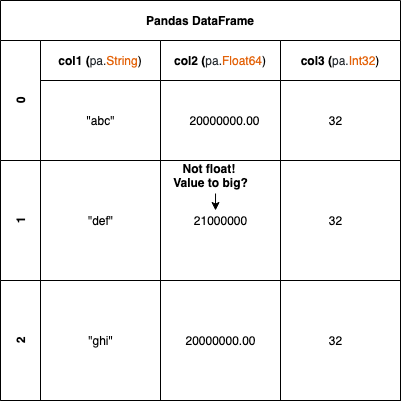

# geomsagi

This project illustrates a dummy example of invoices, and verifies that these invoices follow
a specific schema pattern. See more info under pandera section.



We all know the pain where we want to make sure we have the correct datatypes, and the correct values, would it not be great to be able to determine this in runtime?

Something like:

```python
"col2": pa.Column(
            pa.Float64,
            checks=[
                pa.Check.less_than_or_equal_to(20000000.00),
                pa.Check.greater_than_or_equal_to(0.00),
            ],
            nullable=nullable,
        )
```

Well there is with the help of Pandera! Please read more about it below. This project illustrates an example usage of this
library.

Code has been encapsulated with `docker`.

# Requirements

* python3.7 (if you run locally)
* pipenv
* Docker

# Setup

## Local run
Set python path:
```bash
make pythonpath
```

```bash
make
```

## Not local

Already taken care of automatically, see `Docker section below`

# Third party library usage

## pandas

We use [pandas](https://pandas.pydata.org/) in this project, due to its performance advantages when
dealing with up to over 100 million rows. Which gives a good marginal for performance with the given
limit of `20000000` rows.

For instance, this is a better choice than `pyspark` due to the data size will be to small, and
we don't need distributed computational in this case.

Pandas will also be better here than for instance trying to build our own datastructure with for
example dataclasses. We want this to scale.

## pandera

This project also utilises [pandera](https://pypi.org/project/pandera/) together with Pandas.
Since this project is not a real data project, however we want to strive for correctness,
and performance.

Pandera enables us to be able to determine the
[schema](https://pandera.readthedocs.io/en/latest/dataframe_schemas.html) of a pandas DataFrame
at runtime, which is great and can be compared to using a python dataclass but with more efficiency.

This is very useful when working with large numbers and where we want total correctness of the
datatypes.

Pandera also enables us to do better and more performant complex statistical validations.

## pipenv

This project utilises `pipenv`, due to its correctness, and nice features with dependency checks
via the `Pipfile.lock`. It also enables us to control the Python environment in a nice modular
way.

If a new `library` is added to the `Pipfile`, then run:

```bash
make update
```

# Run

## Docker

```bash
make tear-geomsagi-up geomsagi_set_up_args=--build
```

The service will be up running due to `tty`.

`please note that if you run integration tests in the docker container, you might wanna bump up memory`

Tear down:

```bash
make tear-geomsagi-down
```

# Tests

To run all `(unit/integration)` tests

## Docker

```bash
make ssh-into-container
```

```bash
make test
```

## Locally

```bash
make test
```

## pytest

To see what specific configuration that has been made to the `pytest` test, please look at:

`.coveragec` and `pytest.ini`, for more info read:

* [pytest](https://readthedocs.org/projects/pytest-cov/downloads/pdf/latest/)
* [pytest-cov with .coveragec](https://pytest-cov.readthedocs.io/en/latest/config.html)

Example output:
```json
Name                                                    Stmts   Miss  Cover   Missing
-------------------------------------------------------------------------------------
test_0                                                   43      3    93%   34-35, 39
. . .
test_N                                                   51     39    24%   21-30
-------------------------------------------------------------------------------------
TOTAL                                                    94     43    51%
```

* Stmts - Total lines of code in a specific file
* Miss - Total number of lines that are not covered
* Cover - Percentage of all line of code that are covered, or (Stmts - Miss) / 100
* Missing - Lines of codes that are not covered

## Unit

```bash
make test pytest_test_type=unit
```

## Integration

```bash
make test pytest_test_type=integration
```

### Debug

Debug test with `ipdb`, import and set your `ipdb`:

```python
class Something:
    def __init__(self):
        import ipdb
        ipdb.set_trace()
        self.foo = "foo"
```

Then run:

```bash
make test-ipdb pytest_test_args=<extra arguments> pytest_test_type=<unit/integration>
```

## GIT - PR

This code has not been pushed to `GIT` but it utilises `.pre-commit-config.yaml` for
auto indentation, sorting, etc.

Before pushing a PR run:
```bash
git add <file(s)>
pre-commit
# git add <file(s)>  # if necessary changes has been made by the linter
```